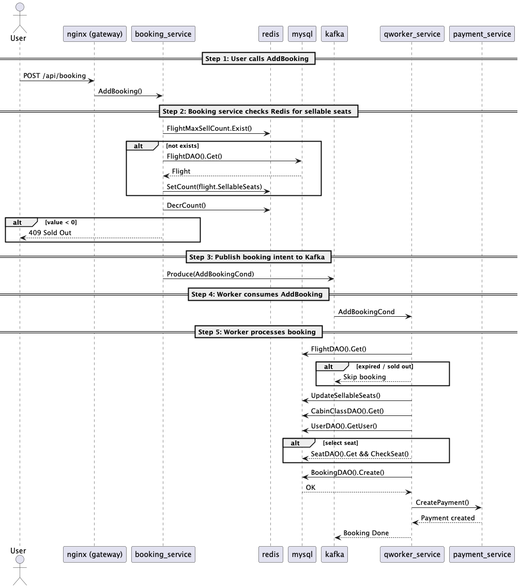
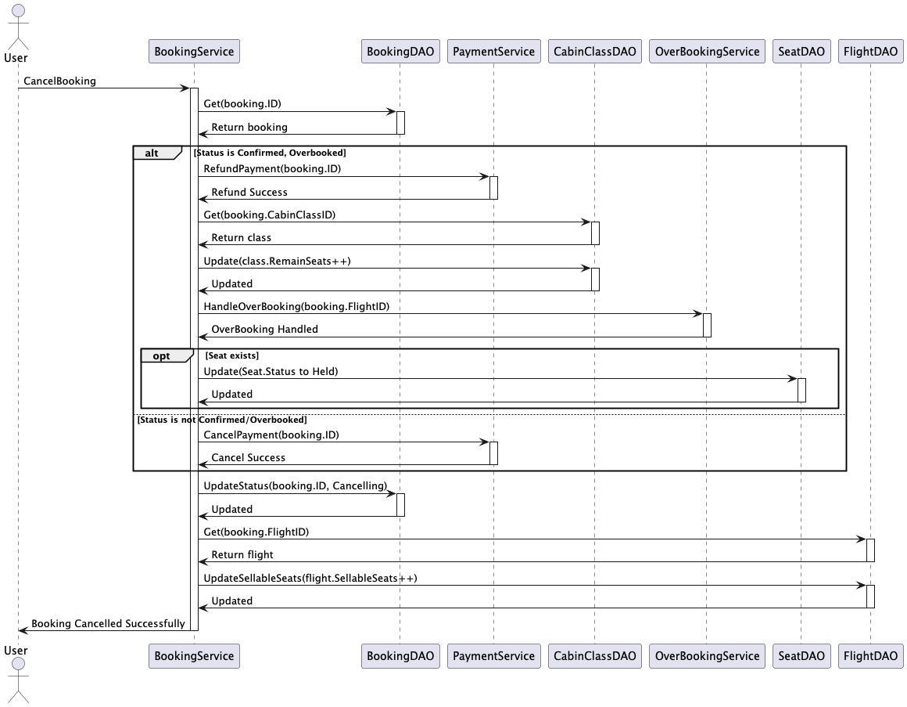
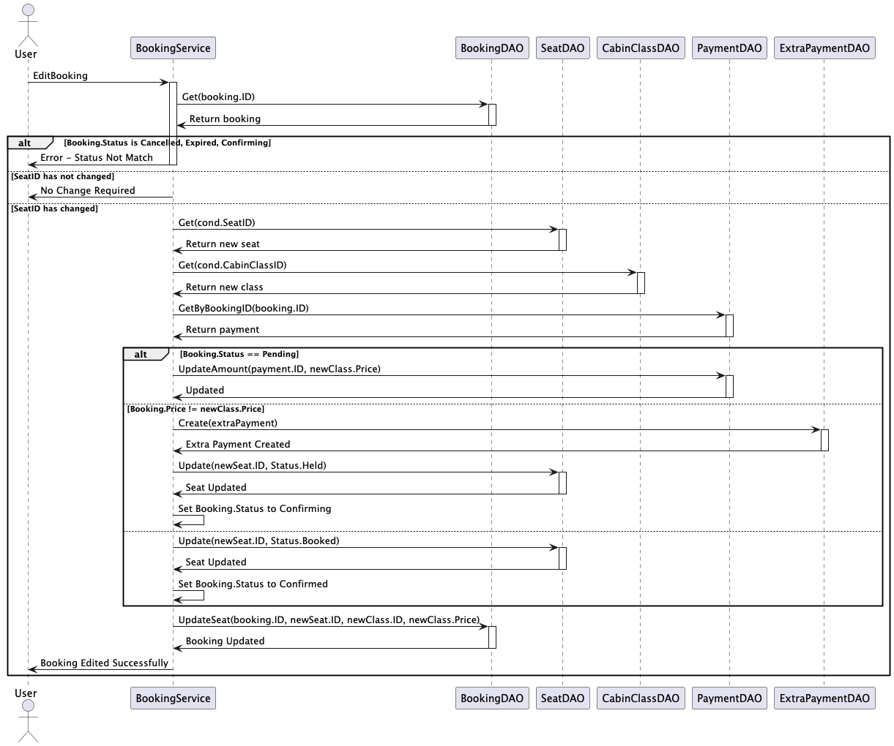

# Airplane - Flight Booking System

## Overview
Airplane is a high-performance flight booking system designed to handle high traffic, concurrent requests, and overbooking scenarios. Built with Go, it provides a scalable and efficient microservices architecture for airline ticket reservations.

## Features
- **Flight Search**: Query available flights by departure, destination, and date.
- **Paginated Results**: Fetch available flights, prices, and remaining seats in a paginated format.
- **Overbooking Management**: Implement overbooking policies.
- **High Concurrency Support**: Optimized for handling large traffic.
- **Microservices Architecture**: Includes flight search, booking, payment, cron service, and queue worker services.
- **Asynchronous Processing**: Uses Kafka for handling booking and payment.
- **Caching Optimization**: Utilizes Redis to reduce database load and improve performance.

## System Architecture
The system is designed using a microservices approach, with the following key components:


1. **Flight Portal Service**: Handles searching for flights based on user criteria.
2. **Booking Portal Service**: Handles booking tickets based on user criteria.
3. **Payment Portal Service**: Handles payment processing for ticket purchases.
4. **Cron Service**: Handles background tasks such as booking check.
5. **Queue Worker Service**: Handles asynchronous processing of booking creation and confirmation.

## Database Schema
### ER Diagram

### Tables
please refer to the [SQL schema](./migrate/rdb/common/V0.0.0_0_1__init.sql) for detailed information on the database tables.

## API Endpoints
Please refer to the [Swagger API documentation](./docs/swagger.yaml) for detailed information on the available endpoints.

## Core Concepts
### Booking Flow


### Confirmation Flow


### Booking Expiration


### Overbooking Management
1. Ticket is canceled. ex: User cancels the ticket for a refund.

2. User is willing to change the seat. ex: User wants to change the seat to a better one.



## Installation
### Prerequisites
- Go
- make
- Docker
- Flyway

### Steps
1. Clone the repository:
   ```sh
   git clone https://github.com/HarveyJhuang1010/airplane
   cd airplane
   ```
2. Gen the swagger, enums...
   ```sh
   make gen
   ```
3. Install dependencies:
   ```sh
   go mod tidy
   ```
4. docker-compose up
   ```sh
   docker-compose up
   ```
5. Migrate the database:
   ```sh
   make migrate-local
   ```

## Testing
- unit tests: to be added
- api tests: please refer to the [api-test.http](./scripts/api-test.http) for detailed information on the available tests.

## License
This project is licensed under the MIT License.

